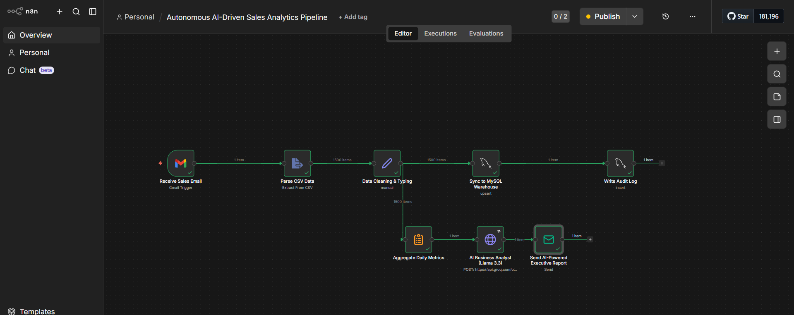

# 🏎️ Honda Sales Sentinel: Autonomous AI-Driven Pipeline & BI

### 🔴 Live Dashboard
https://app.powerbi.com/view?r=eyJrIjoiYWQ4MDgwYmYtMmUzOC00YzJjLThiMWYtNDY4OThlOWExOTgxIiwidCI6ImNjMmRjNWY0LWMwYzgtNGNiZS05NGUzLWRiMDNmYjEwYTVhMiJ9

---

## 📌 1. Business Problem

Traditional sales reporting is slow and manual.

- Managers wait **24+ hours** to see performance  
- Data comes from emails and CSVs → error-prone  
- No fast way to act on underperforming dealers  

**Impact:**  
Delayed decisions and missed revenue opportunities.

---

## 🎯 2. Why I Built This

I wanted to simulate a real-world business scenario where:

- Data arrives in messy formats (emails + attachments)  
- Decision-makers need instant insights  
- Reporting should be automated, not manual  

**Goal:**  
Build a zero-touch system that converts raw data into actionable insights within minutes.

---

## 📊 3. Data Source

This is a simulated dataset designed to reflect real automotive sales:

- ~1,500 daily transactions  
- Dealer-level performance  
- Sales, quantity, and profit metrics  

**Data Format:**
- CSV files sent via email (to mimic real operations)

📂 Check `/04_Sample_Data` for example input.

---

## ⚙️ 4. System Architecture

1. **Email Trigger (Gmail)**
   - Filters: `has:attachment filename:csv`

2. **n8n Workflow**
   - Extract CSV  
   - Clean & transform data  
   - Load into database  
   - Trigger AI summary  

3. **MySQL Warehouse**
   - Stores sales data and audit logs  

4. **AI Layer (Groq + Llama 3.3)**
   - Converts raw data into executive summaries  

5. **Power BI Dashboard**
   - Real-time KPIs  
   - Dealer performance tracking  
   - One-click email actions  

---

## 🚀 5. Key Features

### 🤖 Autonomous AI Reporting
- AI generates daily executive summaries automatically  
- Eliminates manual analysis  

### 📩 Zero-Touch Data Pipeline
- Fully automated ingestion from email to database  

### 📊 Real-Time BI
- Direct connection to MySQL  
- Instant KPI refresh  

### ✉️ One-Click Action (Unique Feature)
- Generate ready-to-send emails directly from dashboard  
- Context-aware (dealer, metrics, performance)  
- No manual typing required  

### 🛡️ Audit Logging
- Tracks every pipeline execution  
- Ensures reliability and transparency  

---

## 🛠️ 6. Tech Stack

- **n8n** → Workflow orchestration  
- **MySQL** → Data warehouse  
- **Groq API (Llama 3.3)** → AI-generated insights  
- **Power BI** → Data visualization  
- **DAX** → KPIs + dynamic email generation  

---

## ▶️ 7. How to Run This Project

### Step 1: Setup Database
- Navigate to `/02_Database`
- Run SQL scripts to create:
  - `sales_data`
  - `audit_log`

---

### Step 2: Setup n8n
- Import workflow:
  ```
  /01_Workflow_JSON/honda_pipeline.json
  ```
- Configure:
  - Gmail credentials  
  - MySQL connection  
  - Groq API key  

---

### Step 3: Test the Pipeline
- Send an email with a CSV attachment  
  (use sample from `/04_Sample_Data`)

**Expected Output:**
- Data inserted into MySQL  
- AI summary generated  
- Execution logged  

---

### Step 4: Open Dashboard
- Open:
  ```
  /03_Dashboard/Honda_Sales.pbix
  ```
- Connect to your MySQL database  
- Click **Refresh**

---

## 📈 8. Expected Results

- Clean, structured sales data in MySQL  
- Automated executive summaries  
- Interactive dashboard showing:
  - Revenue  
  - Profit  
  - Dealer performance  

---

## 📷 9. System Preview

**n8n Workflow**  


**AI-Generated Email**  


**Power BI Dashboard**  


---

## 🧠 10. What This Project Demonstrates

- Building end-to-end data pipelines  
- Automating business workflows  
- Applying AI in real business scenarios  
- Converting raw data into actionable decisions  

---

## 👤 Author

**Shehab El-Batanouny**  
Data Analyst | BI Developer  
