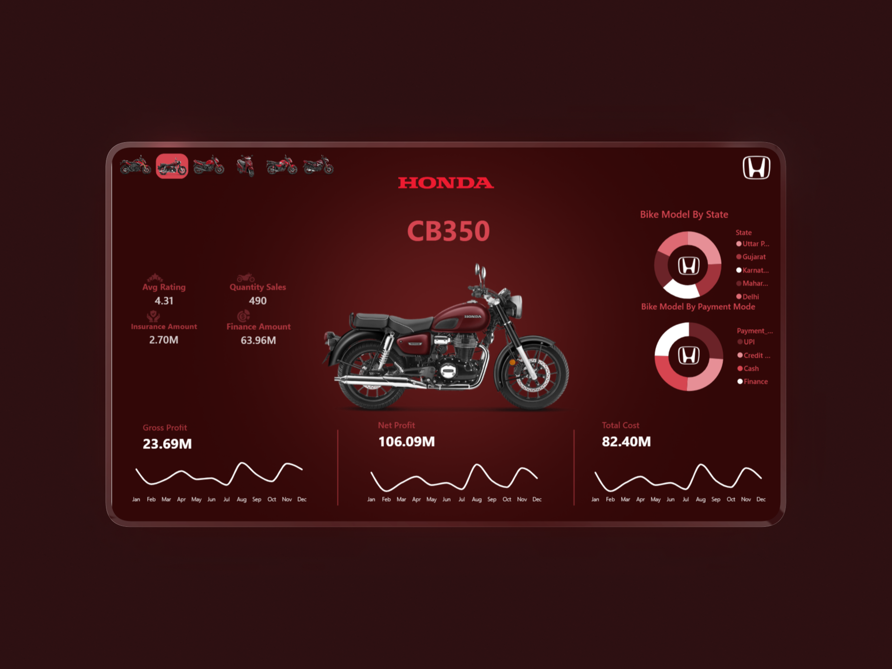

# 🏎️ Honda Sales Sentinel: Autonomous AI-Driven Pipeline & BI

### [🔴 **Click Here to View Project Files**](https://app.powerbi.com/view?r=eyJrIjoiYWQ4MDgwYmYtMmUzOC00YzJjLThiMWYtNDY4OThlOWExOTgxIiwidCI6ImNjMmRjNWY0LWMwYzgtNGNiZS05NGUzLWRiMDNmYjEwYTVhMiJ9)

---

### 📌 Project Overview
This project transforms traditional sales reporting into an **Autonomous Intelligence System**. Instead of manual data entry, I engineered a "Zero-Touch" pipeline that monitors incoming emails, processes raw data, and uses **Generative AI (LLMs)** to deliver executive briefings directly to management.

The goal was to eliminate the 24-hour delay in sales reporting and provide **Immediate Strategic Insights** using an agentic workflow.

---

### 🚀 Key Features & Workflow Architecture
* **🤖 Agentic AI Reporting:** Integrated **Llama 3.3 (70B)** via **Groq API** to act as a Senior Business Analyst, summarizing 1,500+ daily transactions into a concise executive email.
* **📩 Intelligent Ingestion:** Built a **Gmail Trigger** with advanced filtering (`has:attachment filename:csv`) to automatically capture sales data without human intervention.
* **⚙️ Automated ETL & Persistence:** Developed an **n8n pipeline** that cleans raw CSV data and syncs it to a **MySQL Warehouse**, ensuring a single source of truth.
* **📊 Live BI Integration:** Connected **Power BI** directly to the SQL database using a **Star Schema** model, allowing for real-time "Refresh" of all sales KPIs.
* **🛡️ System Audit Logging:** Implemented an automated **Execution Log** that tracks every pipeline run, ensuring 100% system reliability and transparency.

---

### 🛠️ Technical Stack (Skills Used)
* **n8n (Orchestration):** Engineered the entire workflow logic, handling binary files, JSON transformations, and multi-path branching.
* **MySQL:** Designed the relational schema to store historical sales data and process logs.
* **Generative AI (Groq/Llama 3.3):** Applied **Prompt Engineering** to extract business insights and automate professional communication.
* **Power BI:** Built a high-fidelity interactive dashboard focused on Honda's sales performance.
* **DAX & Data Modeling:** Created measures for `Gross Profit`, `Net Sales`, and `Quantity Sold` with a dynamic **Calendar Dimension** for time-series analysis.

---

### 📷 System Preview

**1. The Automation Engine (n8n Workflow)**

**2. Executive Insights (AI-Generated Report)**

**3. Sales Dashboard (Power BI)**

---

### 📥 Project Structure & Usage
This repository is organized for easy replication:
1. **📂 01_Workflow_JSON:** Contains the `honda_pipeline.json` file. You can import this directly into **n8n**.
2. **📂 02_Database:** Includes the SQL scripts to recreate the `sales_data` and `audit_log` tables.
3. **📂 03_Dashboard:** Download the `Honda_Sales.pbix` to explore the live visualizations.
4. **📂 04_Sample_Data:** The raw CSV file used for testing the pipeline.

---
*Developed by **Shehab El-Batanouny** | Data Engineer & BI Developer*
